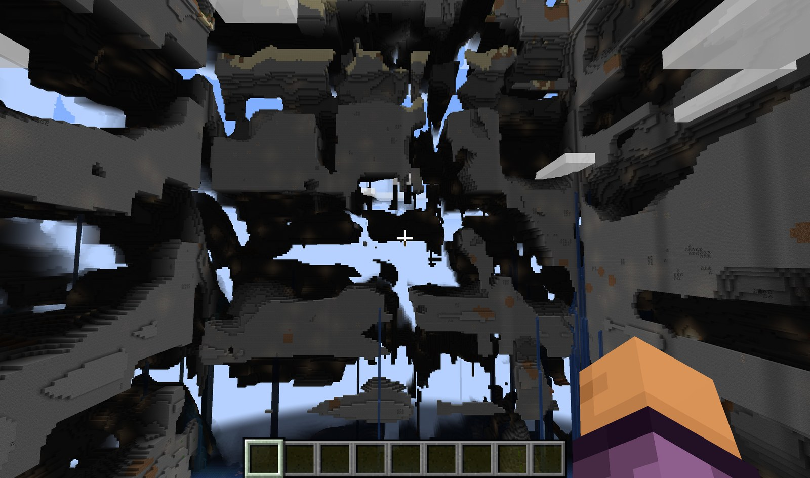

# Border World



> 以**实际出生点**为中心保留一块完全原版的正常区，之外**按 Beta 1.7.3 的旧版机制复现边境之地（Far Lands）**：
> 地形被切成一层层"带草顶的地皮"，层与层横向错开、层间灌满海水，最高的几层一直堆到建造上限。

Fabric 1.21.1 · Java 21 · 客户端/服务端通用

---

## 这是什么

一块"正常世界的孤岛"：出生点周围 10×10 区块（160×160 格）内**与原版逐位一致**（含矿物、洞穴、结构、生物群系），
越出安全区 16 格过渡带后，世界开始变成旧版那种**层叠错位的边境之地**，一直延伸到无穷远。

适合：想看现代版本里"真正像旧版"的边境之地，又不想丢掉出生点那块正常基地。

---

## 效果

| 区域 | 范围（以出生区块中心为起点，切比雪夫距离） | 行为 |
| --- | --- | --- |
| 正常区 | ≤ 80 格（10×10 区块） | 与 Vanilla **逐位一致** |
| 过渡带 | 80 → 96 格（1 区块） | 畸变系数平滑 0 → 1 |
| 边境之地 | ≥ 96 格 | 旧版机制：层叠 + 错位 + 灌水，直到建造上限 |

---

## 还原了旧版的哪些机制

参考 [Minecraft Wiki · Far Lands (Java Edition)](https://minecraft.wiki/w/Far_Lands_(Java_Edition)) 的
*Cause* 与 *Structure* 两节逐条实现：

### ① 高度层叠（Corner Far Lands 的 "the stack"）

> *"layers of terrain stack on top of another repeatedly until it reaches the height limit"*

竖直采样坐标被**折返**，于是同一段地形沿高度一层层重复堆叠：

```text
sampledY = base + mod(y − lift − base, STACK_PERIOD)      // base=24, PERIOD=72
```

每一层的顶部会重新经过地表 → 层顶自然带草皮；层与层之间是横切面与空隙。

### ② 每层横向错位

> *"The number of layers ... varies between five and seven (fusing together and splitting every so often)"*

层不是上下对齐的千层饼，而是**一块块砖墙式错开的地皮**：每层按层号哈希把采样 x/z 再平移
（`FARLANDS_LAYER_OFFSET`），层间露出横切面、空隙与水柱。

### ③ 角落（Corner Far Lands，两轴同时溢出）

> *"consistent when the ratio of how far one axis is past ... to the other is kept the same"*
> *"near-perfect diagonal lines ... all intersect at the corner"*

角落区结构只取决于两轴"超出量"的**比值**，因此层理是从角落放射出去的斜线、
层厚随方向伸缩（融合/分裂）；用绝对值取距离 → 四象限天然镜像。

### ④ 海平面以下灌水

> *"any area beneath sea level, excluding regular caves, are flooded with water"*

原版含水层在 `e = floodedness − h > 0` 时会把区域填到海平面；远区把 floodedness 抬到 1，
于是层间空隙全部被海水淹没（旧版的 "flooded layers"）。

### ⑤ 跟随本地地形

旧版的整数溢出只发生在**低频地形骨架**上，本地那块地的地表材质、植被、细小起伏仍然是本地的。
因此默认 `FARLANDS_AXIS_PIN = 0`：层叠与错位都作用在**本地地形**上，远处仍是本地的草皮/沙地，
而不是"从别处采样的横切面"。（想要旧版那种"沿轴无限延伸的隧道"可把它调向 1。）

### ⑥ 细部参差

切片抬升（`FARLANDS_SLAB_STEP_X/Z`，两轴各 4 档）+ 小尺度混沌（`CHAOS_RANGE`），
让层边界不齐、表面参差。

---

## 参数（`src/main/java/com/borderworld/config/FarlandsConfig.java`）

| 参数 | 默认 | 作用 |
| --- | --- | --- |
| `NORMAL_REGION_CHUNKS` | 10 | 正常区边长（10×10 区块 = 160×160 格） |
| `TRANSITION_WIDTH_BLOCKS` | 16 | 过渡带宽度 |
| `FARLANDS_STACK_PERIOD` | 72 | **层叠周期**：一层多厚（越小层越多；经典 5~7 层） |
| `FARLANDS_VERTICAL_PIVOT` | 24 | 层底高度 |
| `FARLANDS_LAYER_OFFSET` | 72 | **每层横向错位**幅度（砖墙式错位） |
| `FARLANDS_CORNER_DIAGONAL` | 40 | 角落斜线：层理相位随两轴溢出比值的倾斜量 |
| `FARLANDS_CORNER_PERIOD_SWING` | 0.35 | 角落层厚摆幅（层的融合/分裂） |
| `FARLANDS_AXIS_PIN` | 0 | 坐标钉死强度（0 = 跟随本地地形；→1 = 旧版无限隧道） |
| `FARLANDS_SLAB_STEP_X/LATTICE_X` | 40 @ 96 | 切片抬升（X 轴） |
| `FARLANDS_SLAB_STEP_Z/LATTICE_Z` | 28 @ 48 | 切片抬升（Z 轴） |
| `CHAOS_RANGE` | 20 | 小尺度起伏：打散光滑面 |

> 另有若干"实验用、默认关闭"的参数（竖直折回、3D 噪声位移、剪切、水平锯齿、竖直放大）留在配置里，
> 想玩更猛的形变可以逐个打开。

---

## 构建与运行

```bash
# 构建（输出 jar 在 build/libs/）
./gradlew build

# 开发环境：客户端 / 服务端
./gradlew runClient
./gradlew runServer

# 正常区逐位自检（服务端启动时运行，控制台输出 BORDERWORLD 自检结果）
./gradlew runServer -Pbw.selftest=true

# 完全关闭畸变（A/B 对照）
./gradlew runClient -Pbw.warp=false
```

依赖：Fabric Loom 1.11.8 / Fabric Loader 0.19.5 / Fabric API 0.116.17+1.21.1 / Yarn 1.21.1+build.3 / JDK 21。

## 怎么玩

1. 进入存档后正常游玩（默认创造模式 + 已开作弊，便于观察）。
2. 出生点周围就是安全区；**向南/东走约 100 格**就会看到第一片层叠石壁。
3. 建议指令：
   - `/tp 0 80 100` —— 安全区外第一片
   - `/tp 200 130 200` —— 角落区（两轴同时"溢出"，能看斜向层理）
   - `/gamemode spectator` + 飞高 —— 看整片层叠地貌

---

## 工程结构

```text
src/main/java/com/borderworld/
  BorderWorld.java                Mod 入口
  config/FarlandsConfig.java      全部可调参数
  core/
    WorldgenMath.java             纯数学：层叠、错位、混沌、经典 Far Lands 参考数学
    NormalRegion.java             正常区/过渡区几何
    FarlandsTransform.java        坐标变换：层叠折返、每层错位、角落斜理、钉死
    SpawnRegion.java              出生区块锚定（唯一接触 MC 的 core 类）
  worldgen/
    WarpInstaller.java            Overworld 噪声路由安装（噪声叶子包装 + 远区灌水）
    WarpedDensityFunction.java     噪声叶子包装
    WarpedInterpolatedNoiseSampler.java  base_3d_noise（分数坐标版）
    WarpedYClampedGradient.java    深度梯度/滑移项（竖直剖面）
    FarZoneOverrideFunction.java   远区取值覆盖（灌水）
  mixin/                          注入：噪声路由、出生点、开关
tools/
  SelfCheck.java                 纯数学自检（可 javac 直接跑）
  slice_render.py                竖直剖面渲染（看层叠/镂空）
  map_render.py                  俯视图渲染（与旧版地图对照）
  world_compare.py               高度场比较 / 统计 / 接缝 / 渲染
  mc_harness.py                  服务端批量生成驱动（RCON）
docs/
  DESIGN.md                      设计文档（含排查历程与放弃方案）
  VERIFICATION.md                验证记录（逐条实测数据）
  img/farlands-showcase.jpg      效果图
```

`core/` 里的数学**零 Minecraft 依赖**，迁移到新版本时只需重写 mixin 与 `SpawnRegion`。

---

## 验证

- **正常区逐位自检**：`-Dborderworld.selfTest=true` → 正常区与原版逐位一致、边境区已畸变。
- **纯数学自检**：`tools/SelfCheck.java` 独立可跑（层叠折返、每层错位、角落比值、连续性等）。
- 详细的实测数据、剖面图与"试过但放弃的方案"见 [`docs/VERIFICATION.md`](docs/VERIFICATION.md) 与 [`docs/DESIGN.md`](docs/DESIGN.md)。

## 参考

- [Minecraft Wiki · Far Lands (Java Edition)](https://minecraft.wiki/w/Far_Lands_(Java_Edition)) —— Cause / Structure
- [Minecraft Wiki · Java Edition Far Lands/Infdev 20100327 to Beta 1.7.3](https://minecraft.wiki/w/Java_Edition_Far_Lands/Infdev_20100327_to_Beta_1.7.3)

## License

暂未指定（仓库默认保留所有权利）。
